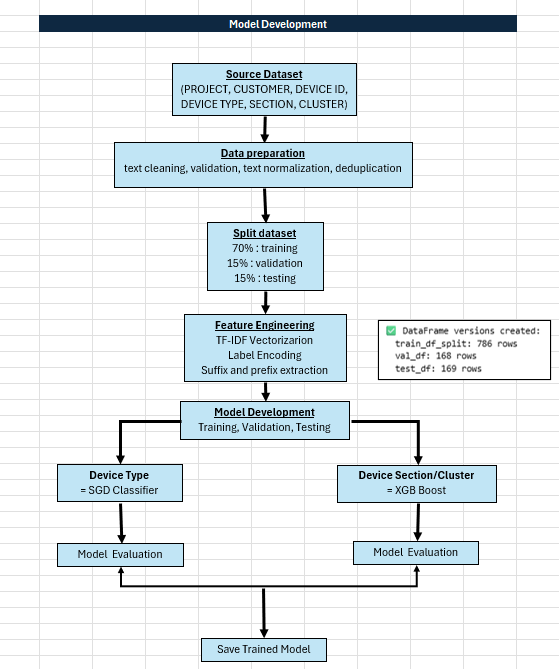
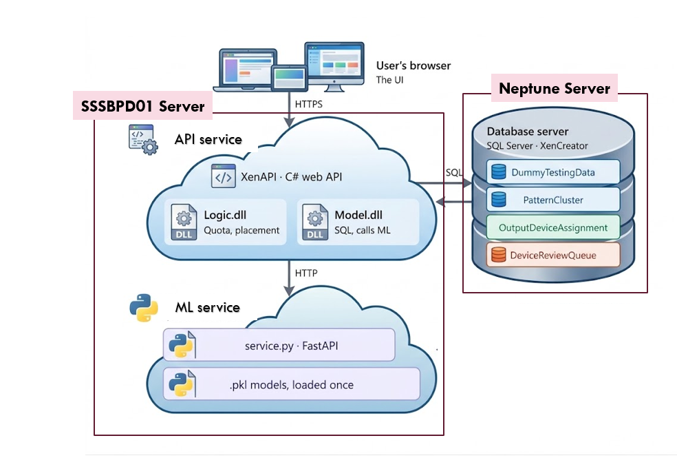
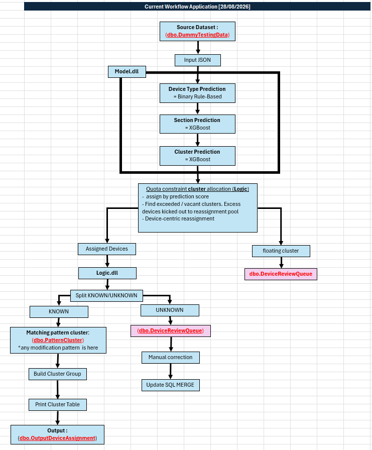
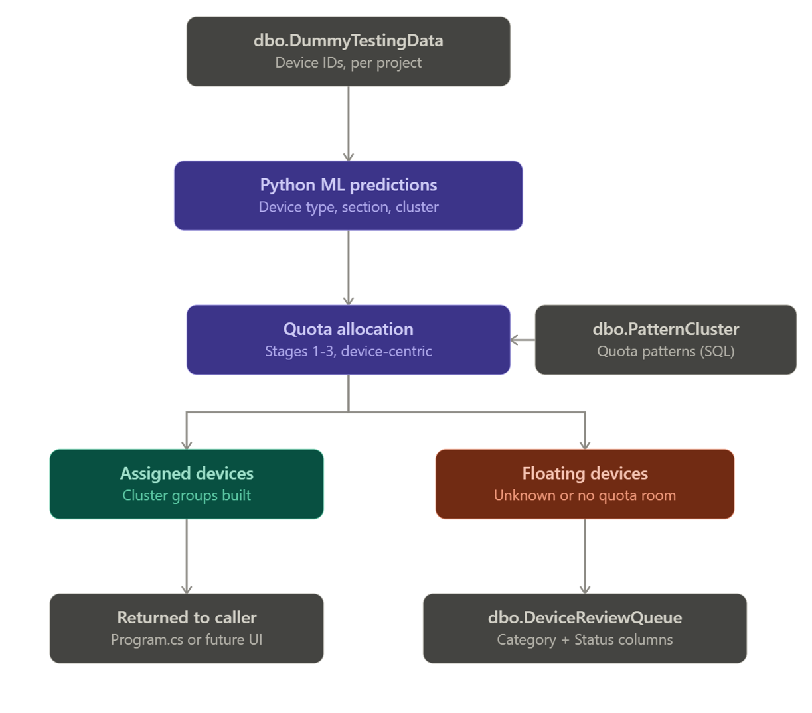
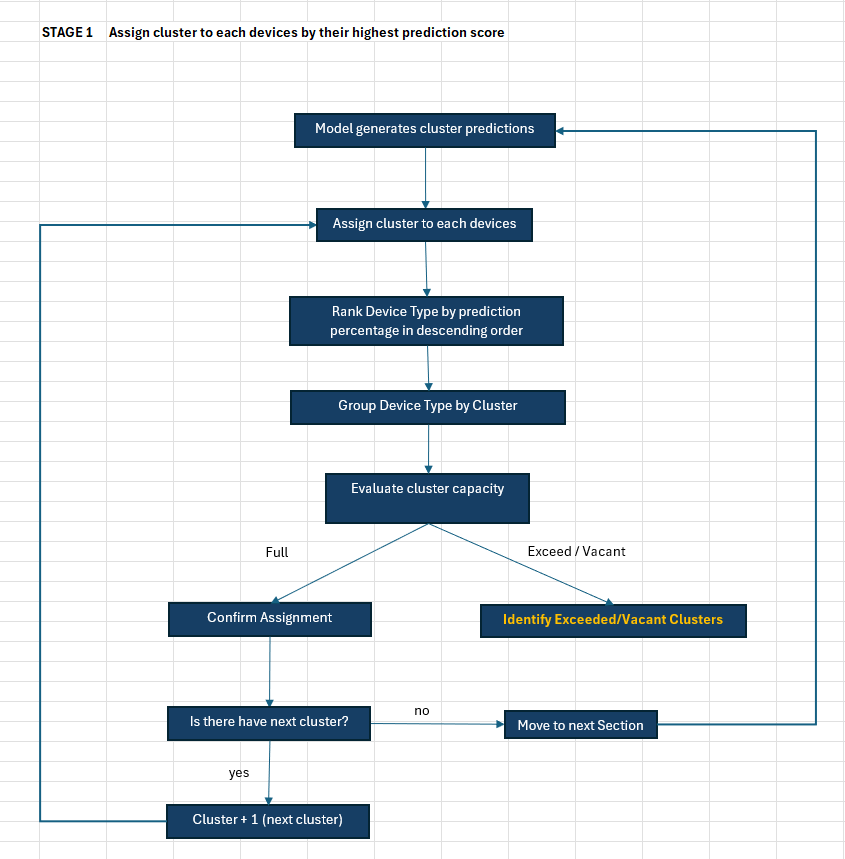
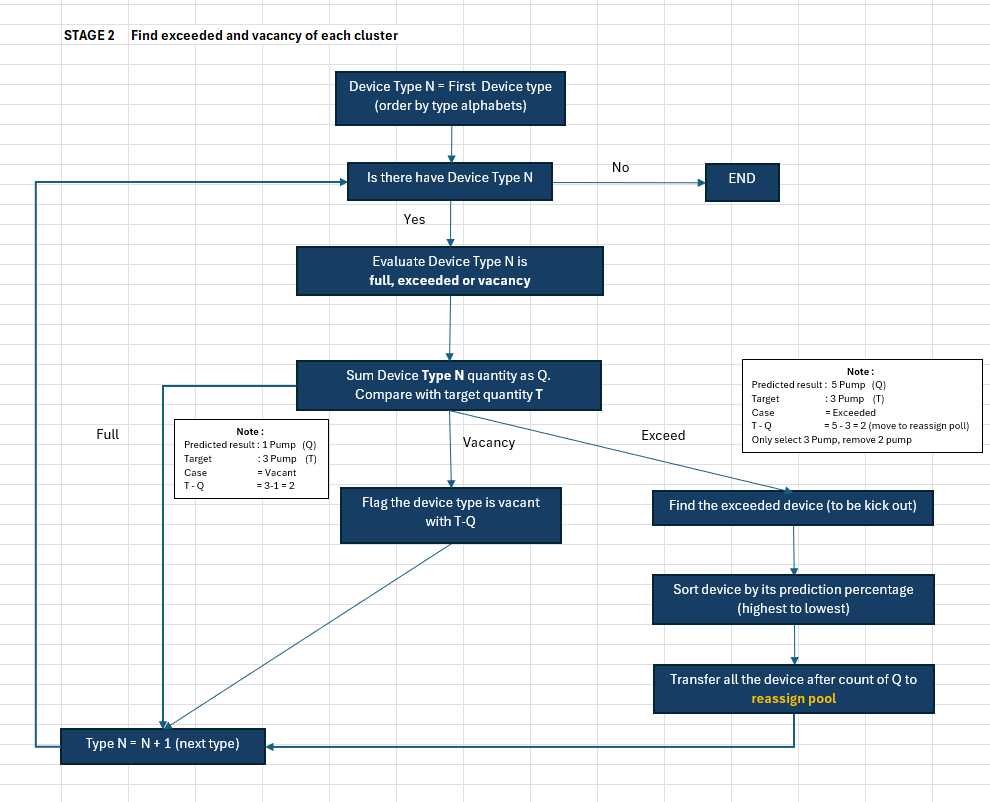
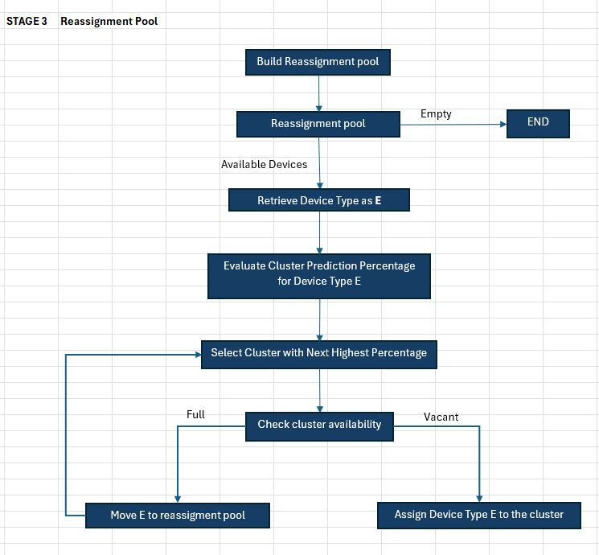

# Flowchart — Device Identifier

## 1. Model Development

## 2. System Architecture

## 3. Full Workflow

### 3.1 Quota Allocation

Source workbook: `Flowchart Development.xlsx` —
[open in OneDrive](https://senergycommy-my.sharepoint.com/personal/sitisyaziyah_senergy_com_my/Documents/Flowchart%20Development.xlsx?web=1)

> Note: the link above points to a personal OneDrive folder and may not be accessible to other team members. Consider moving the workbook into this repository or a shared library.

**Stage 1 — Assign cluster to each device by highest prediction score**

**Stage 2 — Find exceeded and vacant clusters**

**Stage 3 — Reassignment pool**

